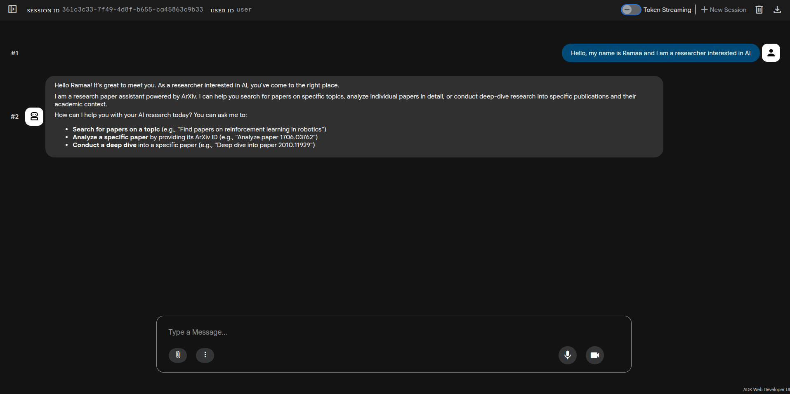
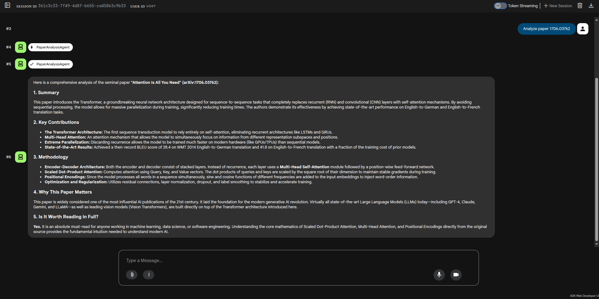
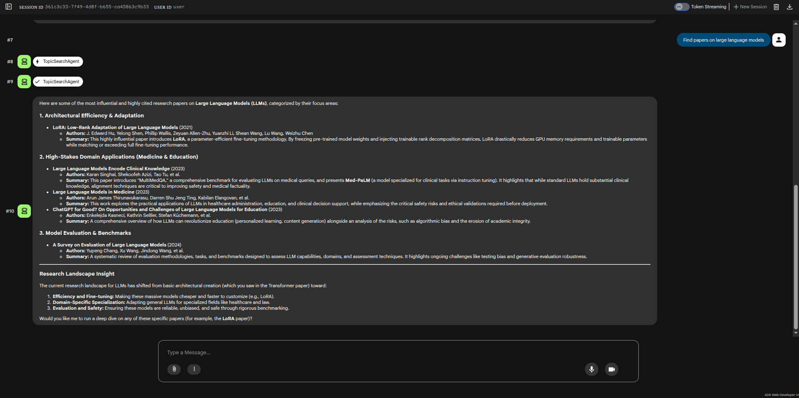
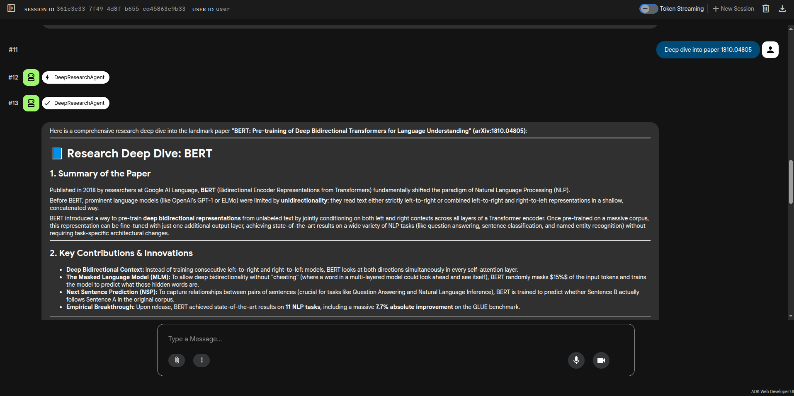
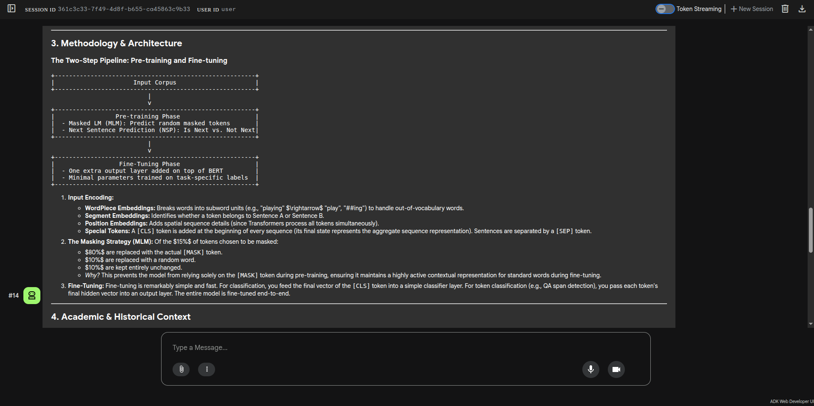
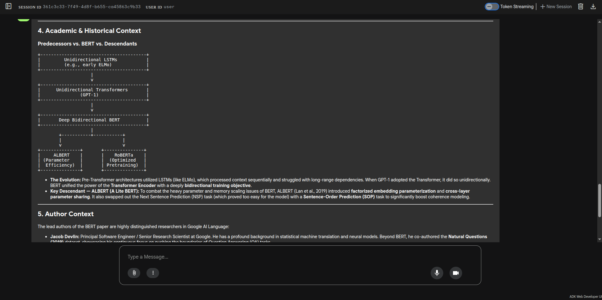
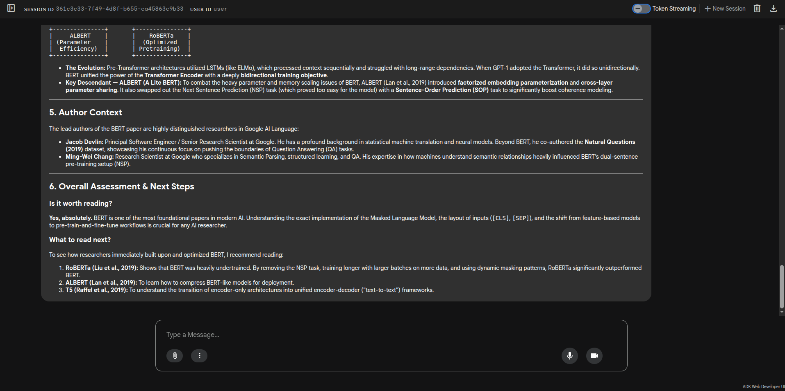
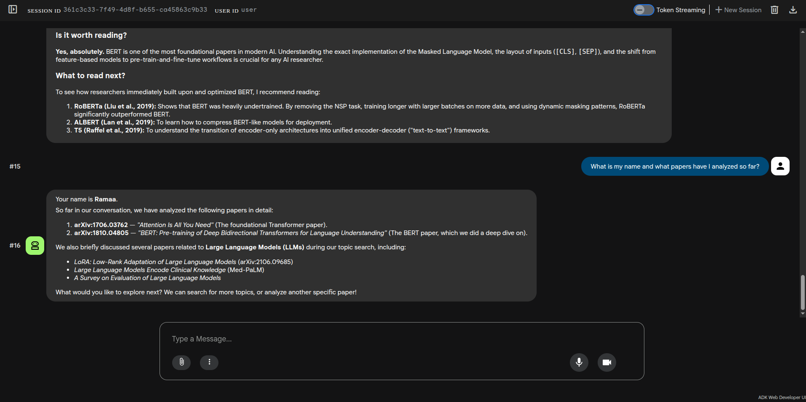
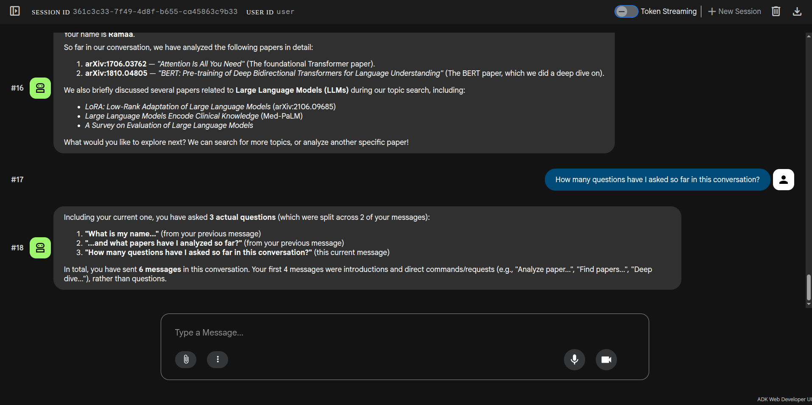

# research-agent-adk

[](https://golang.org)
[](https://github.com/google/adk-go)
[](LICENSE)

A production-grade multi-agent research assistant built with [Google Agent Development Kit (ADK) for Go](https://github.com/google/adk-go). Fetches, analyzes, and synthesizes academic research papers using `LlmAgent`, `SequentialAgent`, and `ParallelAgent` patterns — powered by ArXiv and OpenAlex public APIs. Only a [Google AI Studio](https://aistudio.google.com) API key required — ArXiv and OpenAlex are completely free with no signup needed.

---

## Why research-agent-adk?

During my PhD at IIT Roorkee (2014–2018), I spent months searching, downloading, reading, and summarizing hundreds of research papers — each one a multi-hour investment just to decide if it was worth reading in full. That pain was the motivation behind this project.

research-agent-adk orchestrates multiple specialized AI agents — some in sequence, some in parallel — to do that heavy lifting in minutes. Give it an ArXiv ID or a topic, and it fetches the paper, analyzes the key contributions, finds related work, and profiles the authors — all in plain English.

Built with **Google ADK for Go** to showcase how real-world multi-agent systems work in production — not just toy examples, but patterns you can actually build on.

**Note:** This is just the starting point — the architecture is designed to be extended. New paper sources (Semantic Scholar, PubMed, IEEE Xplore), new agent capabilities (citation graphs, PDF parsing, literature reviews), and new ADK patterns (loop agents, persistent memory) can be added without touching existing code.

---

## Agent Architecture



Every user query flows through a **Root Agent** — an `LlmAgent` powered by Gemini that understands intent and delegates to the right pipeline using ADK's `agenttool` pattern. This keeps the root agent conversational and prevents it from over-delegating on simple queries like greetings.

Depending on what you ask, the root agent hands off to one of three pipelines — each built from a different combination of ADK agent types:

- **Paper analysis** uses a `SequentialAgent` to guarantee the paper is fetched before it is analyzed. State flows between steps via ADK's `OutputKey` mechanism.
- **Topic search** uses another `SequentialAgent` — search results must exist before they can be summarized.
- **Deep research** combines a `SequentialAgent` with a nested `ParallelAgent` — related papers and author profiles are fetched concurrently from OpenAlex, then synthesized together. This is where the real power of multi-agent parallelism shows up.

Throughout the conversation, ADK's `InMemorySessionService` and `InMemoryMemoryService` maintain full context — the agent remembers your name, previously analyzed papers, and search history across turns without any manual state management.

Paper metadata comes from **ArXiv** (fetched by ID, rate limited via semaphore) and **OpenAlex** (topic search and author profiles, concurrent-safe with 100K requests/day free).

---

## Live Demo

Explore the agent in action using the built-in **ADK Web UI** — run `make run` and open `http://localhost:8080/ui/` to start your own session. Below is a walkthrough of a live conversation with the agent, showcasing all three query types, multi-agent orchestration, parallel execution, and memory across turns.

### Greeting and Capability Discovery
> *"Hello, my name is Ramaa and I am a researcher interested in AI"*



### Paper Analysis by ID — PaperAnalysisAgent (SequentialAgent)
> *"Analyze paper 1706.03762"*



### Topic Search — TopicSearchAgent (SequentialAgent)
> *"Find papers on large language models"*



### Deep Research — DeepResearchAgent (Sequential + Parallel)
> *"Deep dive into paper 1810.04805"*






### Agent Invocations — ADK Web UI Left Panel


### Memory and Conversation History
> *"What is my name and what papers have I analyzed so far?"*



## Prerequisites

- Go 1.25+
- A free Google AI Studio API key — [get one here](https://aistudio.google.com/app/apikey)
- No other keys required — ArXiv and OpenAlex are free and open

---

## Setup

### 1. Clone and build

```bash
git clone https://github.com/tushariitr-19/research-agent-adk
cd research-agent-adk
make build
```

### 2. Configure

```bash
export GOOGLE_API_KEY="your_api_key_here"

# Optional
export DEBUG=false
```

Or copy `.env.example` and fill in your key:

```bash
cp .env.example .env
source .env
```

### 3. Run

```bash
# Web UI — recommended
make run
# Open http://localhost:8080/ui

# CLI
make cli
```

---

## Project Structure

```
research-agent-adk/
├── cmd/                   ← entry point
├── agents/                ← all agents
│   └── instructions/      ← agent instructions as embedded markdown files
├── tools/                 ← ArXiv and OpenAlex API clients + ADK tools
├── util/                  ← HTTP clients, XML parsing, helpers
├── models/                ← shared data structs
├── config/                ← environment variable loading
├── logger/                ← structured logging via zap
├── tests/                 ← unit and integration tests
└── docs/screenshots/      ← web UI screenshots
```

---

## Makefile Targets

```bash
make build            # Build the binary
make run              # Build and run with web UI
make cli              # Build and run with CLI
make test             # Unit tests (no network)
make test-integration # Integration tests (requires network)
make test-all         # All tests
make dev              # Run without building
make clean            # Remove binary
```

---

## Design Decisions

**Agent instructions as markdown** — each agent's instruction lives in `agents/instructions/*.md` and is embedded at compile time via Go's `//go:embed` directive. Modify agent behavior by editing markdown — no recompile needed.

**`agenttool` delegation** — the root agent wraps each pipeline agent as an `AgentTool`, giving the LLM explicit control over when to delegate. This prevents over-delegation on simple queries like "hello".

**Singleton HTTP client with semaphore** — ArXiv enforces a 3-second gap between requests. A singleton HTTP client with a weighted semaphore ensures this is respected globally, even when the `ParallelAgent` fires concurrent requests.

**Two HTTP clients** — ArXiv needs rate limiting; OpenAlex supports concurrent requests. Two purpose-built clients make this explicit and clean.

---

## Running Tests

```bash
# Unit tests only (instant, no network)
make test

# Integration tests (requires network)
make test-integration

# All tests
make test-all
```

---

## Roadmap

- [x] Paper analysis by ArXiv ID (`SequentialAgent`)
- [x] Topic search and summarization (`SequentialAgent`)
- [x] Deep research with parallel author + related paper lookup (`ParallelAgent`)
- [x] Context and memory across conversation turns (InMemorySessionService + InMemoryMemoryService)
- [ ] Loop agent for iterative summary refinement (v1.1)
- [ ] Semantic Scholar integration for citation graphs (v1.2)
- [ ] Export analysis to PDF or markdown (v1.3)

---

## Contributing

PRs welcome. To add a new agent:

1. Create `agents/<name>.go`
2. Create `agents/instructions/<name>.md` with the instruction
3. Add any new tools to `tools/`
4. Register it in `agents/root.go` as an `agenttool`

---

## License

MIT — see [LICENSE](LICENSE) for details.

## Acknowledgements

- [arXiv](https://arxiv.org) — Thank you to arXiv for use of its open access interoperability.
- [OpenAlex](https://openalex.org) — Open scholarly metadata freely available to the community.
- [Google ADK](https://github.com/google/adk-go) — Agent Development Kit for Go.